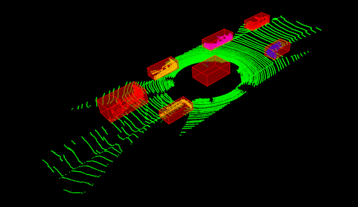

# Obstalce detection on Highway using LiDAR(SFND project)
This project involves detection of obstacles(vehicles, pedestrians and other types) on the road using point cloud data obtained from 
LiDAR sensor placed on the car. Point cloud data is processed using the `C++` library, `PCL`(Point Cloud Library). This is part
of the first project on sensor fusion course on Udacity.
1) At first, the point cloud data is passed through the initial pre-processing layer which filters a certain useful window 
of the road to reduce computation burden by sending only relevant data to the later stage of processing pipeline. 
   Unnecessary data like rooftop points of the source car are also filtered.
2) The filtered points are then passed to the segmenation block where RANSAC method is applied to extract the road
plane from the data. This step segments the data into two block: road points and other obstacle points.
   
3) Euclidean clustering is then performed to cluster different obstacles on the road. kD-trees are used to perform nearest
neighbor search for clustering.
   
4) The obstacle clusters are then used to calculate their corresponding bounding boxes for visualization.

The project also contains implementation of RANSAC and kD-trees using both from scratch as well as PCL library functions. 
PCL library perform significantly faster than the vanilla implementation. Both implemenations can be chosen from the 
`environment.cpp` file.
A sample of the output is shown below.

<p align="center">
  
</p>

## Installation

### Ubuntu 

```bash
$> sudo apt install libpcl-dev
$> cd ~
$> git clone https://github.com/nirajbasnet/Obstacle-detection-on-Highway-using-LiDAR-SNFD-Project.git
$> cd Obstacle-detection-on-Highway-using-LiDAR-SNFD-Project
$> mkdir build && cd build
$> cmake ..
$> make
$> ./environment
```

### Windows 

http://www.pointclouds.org/downloads/windows.html

### MAC

#### Install via Homebrew
1. install [homebrew](https://brew.sh/)
2. update homebrew 
	```bash
	$> brew update
	```
3. add  homebrew science [tap](https://docs.brew.sh/Taps) 
	```bash
	$> brew tap brewsci/science
	```
4. view pcl install options
	```bash
	$> brew options pcl
	```
5. install PCL 
	```bash
	$> brew install pcl
	```

#### Prebuilt Binaries via Universal Installer
http://www.pointclouds.org/downloads/macosx.html  
NOTE: very old version 

#### Build from Source

[PCL Source Github](https://github.com/PointCloudLibrary/pcl)

[PCL Mac Compilation Docs](http://www.pointclouds.org/documentation/tutorials/compiling_pcl_macosx.php)

